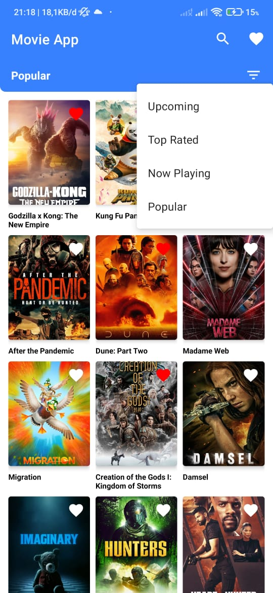
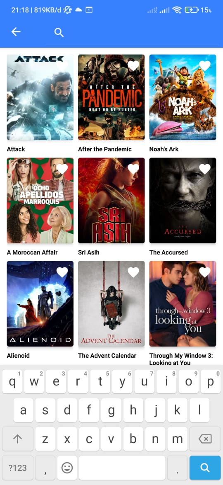
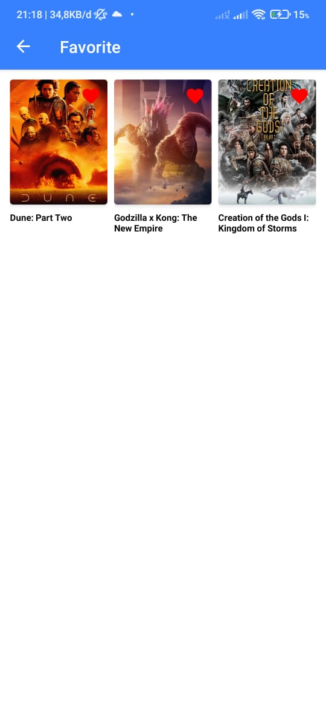

# MovieApp

This is a simple movie app that shows a list of movies and their details. This app is built using the MVVM architecture pattern and uses the TMDB API to fetch the movie data.

## Screenshots
   

## Features
- Show a list of movies
- Show movie details
- Search for movies
- Add movies to favorites
- Show favorite movies
- Remove movies from favorites

## Service API
- [The Movie Database (TMDb)](https://www.themoviedb.org/documentation/api)

## Tech Stack
- Kotlin
- Coroutines
- Flow
- Dagger Hilt
- Retrofit
- Room
- Paging 3
- Glide
- Encrypted Database (SQLCipher)
- Obfuscation (ProGuard)
- Certificate Pinning
- CI/CD (GitHub Actions)

## Architecture
- MVVM (Model-View-ViewModel)
- Clean Architecture
- SOLID Principles
- Dependency Injection
- Modularization
- Dynamic Feature Module
